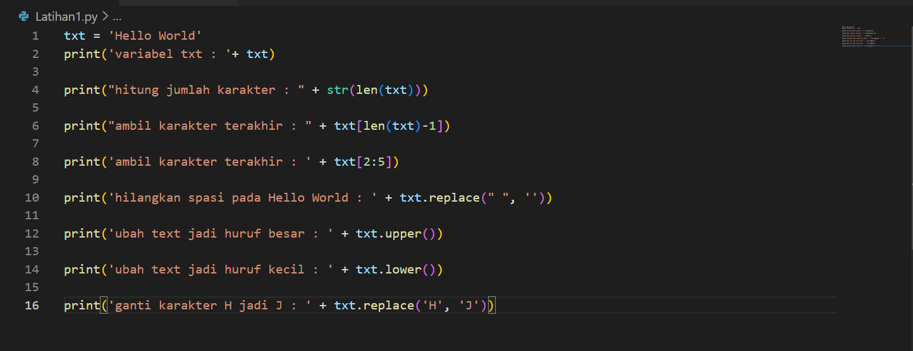

Nama : M Muammar

NIM   : 312210663

Kelas : TI.22.B1

---

## Praktikum 10 ##
Tugas untuk melengkapi praktuikum 10 pertemuan 14

## String ##
penjelasan

Latihan 1

Tuliskan codingan sebagai berikut:

Akan menghasilkan output seperti dibawah ini:

Latihan 2

Tuliskan codingan sebagai berikut:

Akan menghasilkan output sebagai berikut:

## Terima kasih ##
